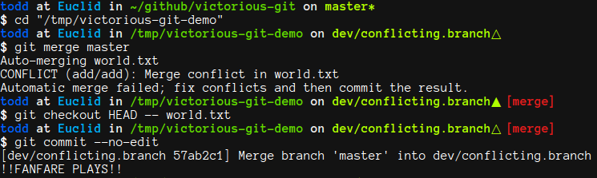

# victorious-git [](https://travis-ci.org/twolfson/victorious-git)

Play fanfare after triumphing over `git` conflicts

This is heavily inspired by @DanaDanger's `victorious-merge`

**Features:**

- Plays fanfare on resolution of `git` conflicts from:
    - [x] `merge`
    - [ ] `rebase`
    - [ ] `cherry-pick`
- Doesn't play fanfare on trivial merge (i.e. no conflicts/conflicts automatically resolved)
- Cross-platform support on GNU/Linux and OS X
- Play custom fanfare
- Support for `git>=1.7` and `git>=2.0`



Fanfare: https://www.freesound.org/data/previews/258/258142_4631294-lq.mp3

## Warning
Before we get to the fun part (runnning this), we should cover what's going on and the reprecussions. We are using a setting in `git` known as `init.templatedir`. As the name implies, this is a folder that is used to initialize all future `.git` folders.

We are overriding the entire `.git/hooks` folder default ([typically full of samples][git-hooks-default]). As a result, we will also be conflicting with per-repo hooks (e.g. some teams like to enforce linting on each commit). So here is your warning:

[git-hooks-default]: https://github.com/git/git/tree/v2.4.6/templates

**`victorious-git` adjusts with your `.git/hooks` folder for all future repositories.**

**Please take caution and be aware that this will adjust future `.git/hooks` interactions, such as before/after commits occur.**

## Installation
### One line install
The following installs `victorious-git` to `~/.config/victorious-git` and sets up a **user-wide** `init.templatedir`.

```bash
(cd /tmp/ && (test -d victorious-git || git clone --depth 1 https://github.com/twolfson/victorious-git) && cd victorious-git/ && bin/install.sh)
```

By default, this will play [Level win.wav by Tuudurt][level-win-page] from [freesound.org][] which is licensed under [CC0 (Public Domain)][CC0].

[level-win-page]: https://www.freesound.org/people/Tuudurt/sounds/258142/
[freesound.org]: https://www.freesound.org/
[CC0]: http://creativecommons.org/publicdomain/zero/1.0/

https://www.freesound.org/data/previews/258/258142_4631294-lq.mp3

If you would like to provide your own music sample, this can be done via `VICTORIOUS_GIT_MUSIC_URL`:

```bash
export VICTORIOUS_GIT_MUSIC_URL="http://my-server.com/path/to/music.mp3"
(cd /tmp/ && (test -d victorious-git || git clone --depth 1 https://github.com/twolfson/victorious-git) && cd victorious-git/ && bin/install.sh)
```

#### Test drive
Feeling uncertain about installing `victorious-git`? Give it a test drive. The following script will set up a temporary `git` directory using `--template` (no global installation):

```bash
(cd /tmp/ && (test -d victorious-git || git clone --depth 1 https://github.com/twolfson/victorious-git) && cd victorious-git/ && bin/test-drive.sh)
# Creates new git repo at `/tmp/victorious-git-demo/`
# Sets up branches ready to be conflicts
# Outputs commands to let you pull the switch (e.g. `git merge`, `git commit`)
```

### Symlink installation
By using symlinks, we can retroactively apply changes to `victorious-git` bound repositories (e.g. upgrades, changing music).

**This is very dangerous because it effectively makes all `.git` repositories share the same `hooks/` folder. This means adding a hook in `~/repo1/.git/hooks/prepare-commit-msg` will add the hook to `~/repo2/.git/hooks`.**

```bash
# Navigate to a temporary location
cd /tmp/

# Clone our repository
git clone --depth 1 https://github.com/twolfson/victorious-git
cd victorious-git/

# Run our symlink install script
bin/install-symlink.sh
```

### Adding `victorious-git` to existing repositories
To integrate `victorious-git` in existing `git` repositories, we can use the following commands:

```bash
# Inside of our repository (e.g. `victorious-git`)
# Delete our existing `git` hooks
rm -r .git/hooks/

# Reinitialize the repository (leverages template directory)
# This will not destroy `git` history
git init

# Proof that hooks are installed
ls .git/hooks/
```

To run this across multiple projects, we can use:

```bash
# Iterate over each of our folders
for repo_dir in {{glob}}; do
# For example, I store all my projects in `~/github` (e.g. `~/github/victorious-git`)
#   so this would be:
# for repo_dir in ~/github/*; do
    # Enter the folder
    cd "$repo_dir"

    # Reinitialize our hooks
    rm -r .git/hooks/
    git init

    # Exit the folder
    cd -
done
```

## Configuration
### Music
Upon installation, you should hear our sound play once. You can listen to the current sound via:

```bash
~/.config/victorious-git/dotgit/hooks/play-victory.sh ~/.config/victorious-git/dotgit/hooks/victory.mp3
```

If you would like to update the installed music, this can be done via:

```bash
music_url="http://my-server.com/path/to/music.mp3"
wget "$music_url" --output-document ~/.config/victorious-git/dotgit/hooks/victory.mp3
```

### Volume
`victorious-git` attempts to use `afplay` and falls back to `mplayer` for its music playback. To determine if you are using `afplay`, run:

```bash
# This will have output if we are using `afplay`
which afplay
```

If `afplay` is being used, its volume can be set via `VICTORIOUS_GIT_VOLUME`. By default, this is 5.

```bash
export VICTORIOUS_GIT_VOLUME=10
# Adjusts our `afplay -v 5` to `afplay -v 10`
```

To set this permanently for your user, it can be added to your `~/.bashrc`. This includes `zsh`/`fish`/etc users as all our scripts use a `bash` shebang (`#!`).

```bash
echo "export VICTORIOUS_GIT_VOLUME=10" >> ~/.bashrc
```

## Testing
Tests can be run via the following command:

```bash
test/index.sh
```

By default, we disable `test/install.sh` which runs installation tests on a user. This command has the potential to destroy existing setups.

To run the install test, use the `TEST_INSTALL` environment variable:

```bash
TEST_INSTALL=TRUE test/index.sh
```

## Contributing
In lieu of a formal styleguide, take care to maintain the existing coding style. Add unit tests for any new or changed functionality. See the [Testing section](#testing) on how to run tests.

## Donating
Support this project and [others by twolfson][gratipay] via [gratipay][].

[![Support via Gratipay][gratipay-badge]][gratipay]

[gratipay-badge]: https://cdn.rawgit.com/gratipay/gratipay-badge/2.x.x/dist/gratipay.png
[gratipay]: https://www.gratipay.com/twolfson/

## Attribution
This project is inspired by @DanaDanger's  `victorious-merge`.

Our default sound file comes is by Tuudurt on [freesound.org][].

https://www.freesound.org/people/Tuudurt/sounds/258142/

## Unlicense
As of Jul 21 2015, Todd Wolfson has released this repository and its contents to the public domain.

It has been released under the [UNLICENSE][].

[UNLICENSE]: UNLICENSE
